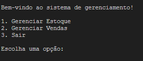
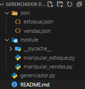

# GERENCIADOR DE ESTOQUE E VENDAS

Este é um projeto de **gerenciamento de estoque e vendas** desenvolvido como parte de um projeto pessoal. O objetivo principal é aprimorar minhas habilidades em programação utilizando Python, modulação de arquivos e manipulação de dados em formato JSON.

## FUNCIONALIDADES

O sistema foi projetado para gerenciar produtos em estoque e realizar vendas, com as seguintes funcionalidades:

- **Adicionar produtos ao estoque**: Permite cadastrar novos itens no estoque, incluindo nome e quantidade.
- **Visualizar produtos em estoque**: Exibe a lista de produtos, com suas quantidades.
- **Realizar vendas**: Permite registrar a venda de produtos, atualizando as quantidades disponíveis no estoque.
- **Relatórios**: Gera relatórios sobre as vendas realizadas e o estado atual do estoque.

## TECNOLOGIAS UTILIZADAS

- **Python**: Linguagem principal para o desenvolvimento do sistema.
- **JSON**: Utilizado para o armazenamento dos dados de estoque e vendas de forma simples e eficiente.
- **Modulação de arquivos**: O projeto foi estruturado em módulos para organizar o código e facilitar a manutenção.



## OBJETIVO

Este projeto foi criado com o objetivo de aprimorar minhas habilidades nas seguintes áreas:

- Programação em Python.
- Manipulação de dados utilizando arquivos JSON.
- Desenvolvimento de sistemas de gerenciamento de informações.


O sistema pode ser facilmente expandido para incluir novas funcionalidades, como integração com bancos de dados, autenticação de usuários, ou até mesmo uma interface gráfica, dependendo dos requisitos futuros.



## COMO EXECUTAR

1. Clone o repositório para sua máquina local:
   ```bash
   git clone https://github.com/Mvini7/GERENCIADOR-DE-ESTOQUE-E-VENDAS
